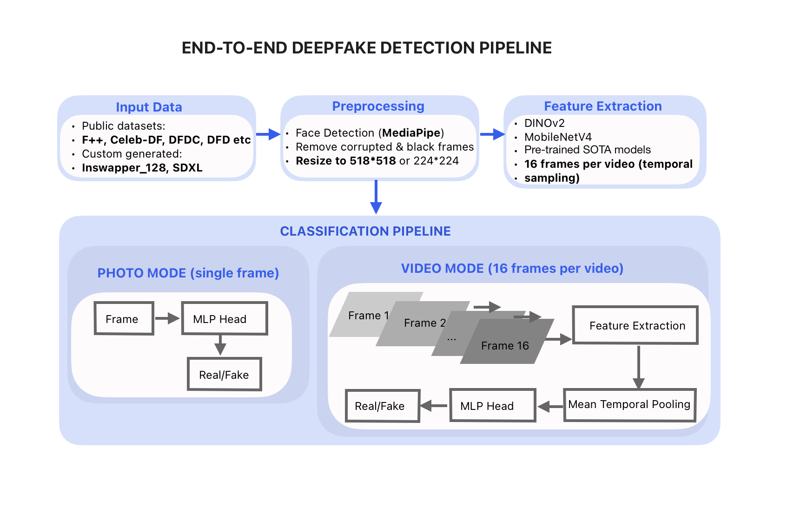
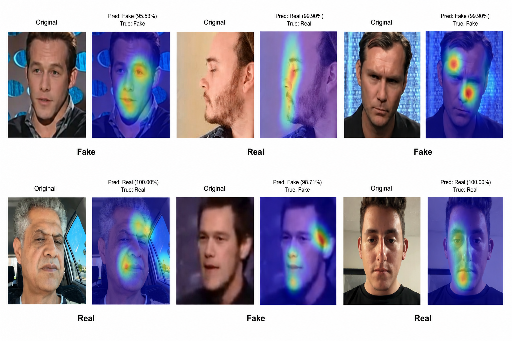

# Deepfake Detection on Edge Devices

Master's thesis: Comparative analysis of lightweight architectures (MobileNetV4, DINOv2)
for deepfake detection on mobile and edge devices.

## Research Goal

Evaluate whether full-frame Vision Transformer architectures (DINOv2) provide a significant
accuracy advantage over lightweight CNN models (MobileNetV4) for deepfake detection,
sufficient to justify their increased computational complexity on resource-constrained edge devices.

## Repository Structure

```

deepfake-detection/
├── examples/
│   ├── inswapper/
│   │   ├── fake_inswapper.mp4          # Face swap example (InSwapper)
│   │   └── real.mp4                     # Original (real) counterpart
│   ├── sdxl/
│   │   ├── fake_sdxl.mp4               # Diffusion-generated example (SDXL)
│   │   └── real.mp4                     # Original (real) counterpart
│   └── GradCAM.png                      # Heatmap visualization of model attention
├── results/
│   └── deepfake_results_slide.png       # Summary slide with metrics and plots
├── schemas/
│   └── deepfake_detection_pipeline.png  # Detection pipeline architecture
├── .gitignore
├── requirements.txt
├── LICENSE
└── README.md

```

## Pipeline Architecture



The pipeline includes:
1. **Video preprocessing** — frame extraction (16 frames per video, uniform sampling)
2. **Feature extraction** — MobileNetV4 (CNN, 224×224) or DINOv2 (ViT-S/14, 518×518)
3. **Temporal pooling** — mean aggregation of frame-level features
4. **Binary classification** — Real vs. Fake (CrossEntropyLoss)

### Training Setup

- **Framework:** PyTorch Lightning
- **GPU:** NVIDIA RTX 3090 (24 GB)
- **Strategy:** Two-stage fine-tuning (frozen backbone → selective unfreeze)
- **Augmentations:** GaussianBlur, RandomSharpness, HorizontalFlip, Rotation(±10°), ColorJitter
- **Optimizer:** AdamW with ReduceLROnPlateau scheduler
- **Early stopping:** patience=7 (photo) / 3–5 (video), monitor=val_roc_auc

### Two Detection Modes

| Mode | Description | Frames |
|------|-------------|--------|
| **Frame-based (photo)** | Independent per-frame classification | 5 frames |
| **Video-based (temporal)** | Mean pooling across 16 frames | 16 frames |

## Key Results

### Detection Performance (Test Set: 9,733 photos / 5,417 videos)

| Model       | Mode  | ROC-AUC | Accuracy | Real Recall | Fake Recall |
|-------------|-------|---------|----------|-------------|-------------|
| DINOv2      | Photo | 0.9990  | 99.5%    | 99.51%      | 99.73%      |
| DINOv2      | Video | 0.9988  | 98.30%   | 98.50%      | 98.20%      |
| MobileNetV4 | Photo | 0.9960  | 94.0%    | 98.10%      | 95.30%      |
| MobileNetV4 | Video | 0.9932  | 96.64%   | 96.50%      | 96.70%      |

### Computational Efficiency (RTX 3090)

| Model       | Params | Disk Size | Inference (ms/frame) | FPS (frames/s) |
|-------------|--------|-----------|---------------------|-----------------|
| MobileNetV4 | 9.2M   | ~36 MB    | 1.1–1.2             | ~812–933        |
| DINOv2      | 22.1M  | ~88 MB    | 2.9–3.3             | ~304–348        |

### Comparison with State-of-the-Art

Classical baselines (Xception, EfficientNet-B4) on standard benchmarks (FF++):
- Accuracy: 94.5%–96.3%
- ROC-AUC: 0.95–0.98

**MobileNetV4 on a combined dataset including diffusion-generated fakes:**
- ROC-AUC: 0.9932
- Accuracy: 96.64%
- **2.4× smaller than DINOv2, comparable quality**

## Dataset

**AuthorDeepFake-6600:**
- 3,300 real / 3,300 fake videos
- Generation methods: InSwapper (InsightFace), SDXL (Stable Diffusion XL)
- Public benchmarks included: FF++, Celeb-DF-v2, DFDC, DFD, DF40
- License: Public Domain / CC0 (original footage)

Total training corpus: 43,762 videos across 8 sources.

### Examples Demonstration

#### 1. InSwapper (Face Swap Detection)
<table width="100%">
  <tr>
    <td width="50%" align="center"><b>Real Video</b></td>
    <td width="50%" align="center"><b>Fake (InSwapper)</b></td>
  </tr>
  <tr>
    <td><video src="https://githubusercontent.com" width="100%" controls></video></td>
    <td><video src="https://githubusercontent.com" width="100%" controls></video></td>
  </tr>
</table>

#### 2. SDXL (Diffusion-Generated Detection)
<table width="100%">
  <tr>
    <td width="50%" align="center"><b>Real Video</b></td>
    <td width="50%" align="center"><b>Fake (SDXL)</b></td>
  </tr>
  <tr>
    <td><video src="https://githubusercontent.com" width="100%" controls></video></td>
    <td><video src="https://githubusercontent.com" width="100%" controls></video></td>
  </tr>
</table>


## Model Interpretability (Grad-CAM)



Grad-CAM heatmaps for MobileNetV4 on real and fake samples.
Warm colors (yellow/red) indicate regions of highest model attention.

**Key observations:**
- MobileNetV4 focuses on facial regions (eyes, nose, face contour) for correct classification
- For fake images, attention shifts to texture inconsistencies and generation artifacts
- DINOv2 (ViT architecture) distributes attention uniformly across patches due to global self-attention

## Key Findings

1. **DINOv2 vs MobileNetV4:** AUC difference = 0.003–0.006 — negligible in practice
2. **MobileNetV4 is 2.4× smaller** (9.2M vs 22.1M params) with comparable detection quality
3. **Video-mode improves MobileNetV4** (accuracy 94% → 96.6%) but not DINOv2
4. **H2 partially confirmed:** DINOv2 is slightly better, but the gap does not justify the computational cost for edge deployment

## Practical Recommendations

| Scenario | Recommended Model | Mode |
|----------|-------------------|------|
| Mobile apps, embedded cameras | MobileNetV4 | Frame-based |
| Access control, office surveillance | MobileNetV4 | Video-based |
| Banking KYC, forensic analysis | DINOv2 | Video-based |

## Hardware

- **Training:** NVIDIA RTX 3090 (24 GB)
- **Target deployment:** Edge devices (MobileNetV4), Servers (DINOv2)

## Tech Stack

PyTorch, PyTorch Lightning, timm, torchmetrics, Grad-CAM, OpenCV, Hugging Face Hub

## License

© 2026 Perina Daria. All rights reserved.

This work is licensed under [CC BY-NC-ND 4.0](https://creativecommons.org/licenses/by-nc-nd/4.0/).
Any use beyond this license requires written permission from the author.

## Status

Master's thesis, 2026. Dataset and code available upon request.